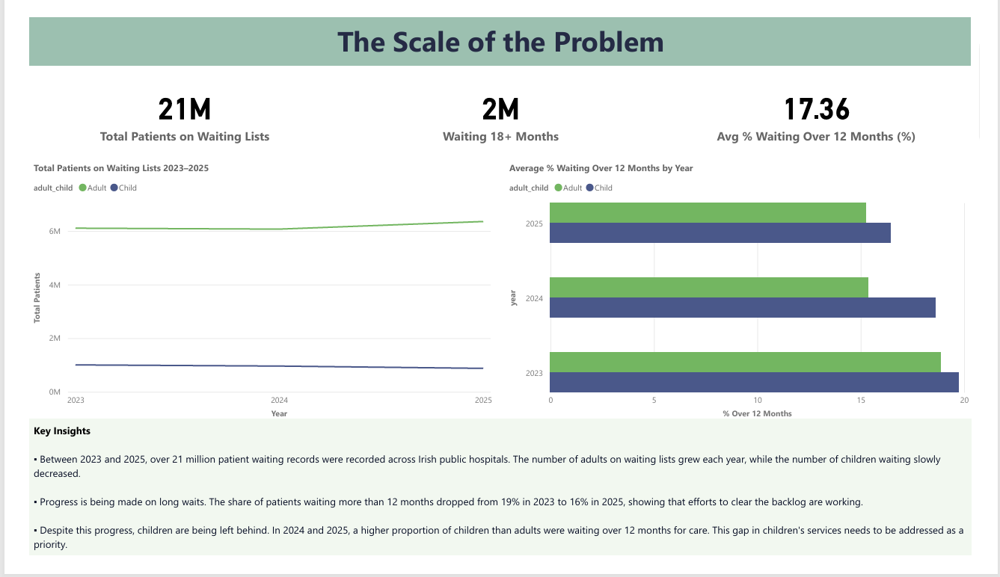
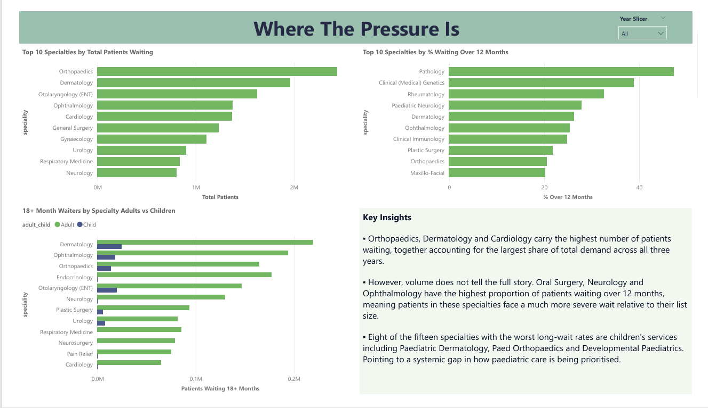
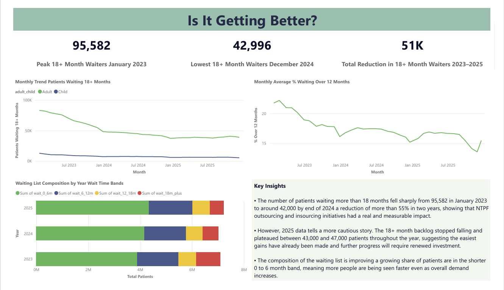

# 🏥 Irish Healthcare Waiting List Analysis 2023–2025

> **Is Ireland making real progress on its hospital waiting list crisis — and who is being left behind?**

A data analytics project examining three years of real outpatient waiting list data from Irish public hospitals, using open data published by the National Treatment Purchase Fund (NTPF).


---

## 📌 Project Overview

Ireland's hospital waiting list crisis is one of the most talked-about issues in Irish public life. This project goes beyond the headlines to analyse what is actually happening — who is waiting, how long they are waiting, whether things are getting better, and which patient groups are being left behind.

Using 36 monthly snapshots from January 2023 to December 2025, this project covers over 2,920 records across 61 to 64 medical specialties for both adult and child patients. The analysis produces five connected findings and three policy-level recommendations.

---

## 🎯 Key Findings

| # | Finding |
|---|---|
| 1 | Overall patient demand grew to 7.2M records in 2025, even as long-wait rates improved year on year |
| 2 | Orthopaedics, Dermatology and Cardiology carry the highest volume — but Neurology and Ophthalmology have the most severe backlogs |
| 3 | Children are now proportionally worse off than adults for 18+ month waits — a reversal from 2023 |
| 4 | The 18+ month backlog fell by 55% between January 2023 and December 2024, then stalled throughout 2025 |
| 5 | Oral Surgery (62.88%), Rheumatology Child (49.75%) and Clinical Genetics (46.52%) have the highest rates of critical long waiters |

---

## 🛠️ Tools Used

| Tool | Purpose |
|---|---|
| **Microsoft Power Query** | Combining and cleaning three annual CSV files |
| **PostgreSQL 16** | Database creation, data loading, and SQL analysis |
| **Microsoft Power BI** | Three-page interactive dashboard |

---

## 📁 Project Structure

```
irish-healthcare-waiting-list/
│
├── Data/
│   └── irish_waiting_list_clean.csv         # Combined and cleaned dataset (all 3 years)
│
├── SQL/
│   └── waiting_list_analysis.sql            # All five SQL queries with annotations
│
├── Dashboard/
│   └── irish_healthcare_waiting_list.pdf    # Power BI dashboard export
│
├── Screenshots/
│   ├── Page1_The_Scale_of_the_Problem.png
│   ├── Page2_Where_The_Pressure_Is.png
│   └── Page3_Is_It_Getting_Better.png
│
├── Report/
│   └── Irish_Healthcare_Waiting_List_Report.docx
│
└── README.md
```

---

## 📊 Dataset

- **Source:** [NTPF Open Data Portal](https://www.ntpf.ie/waiting-list-data/open-data/)
- **Coverage:** Outpatient (OP) waiting lists by specialty — January 2023 to December 2025
- **Published:** Monthly on the second Friday of each month
- **Total rows after combining:** 2,920
- **Specialties consistently tracked:** 58 across all three years

### Column Reference

| Column | Description |
|---|---|
| `archive_date` | Monthly snapshot date |
| `adult_child` | Patient group — Adult or Child |
| `speciality` | Medical specialty name |
| `wait_0_6m` | Patients waiting 0–6 months |
| `wait_6_12m` | Patients waiting 6–12 months |
| `wait_12_18m` | Patients waiting 12–18 months |
| `wait_18m_plus` | Patients waiting 18+ months |
| `total_waiting` | Total patients on waiting list |
| `year` | Derived from archive_date |
| `month_num` | Derived month number (1–12) |
| `pct_over_12m` | % of patients waiting over 12 months |

---

## 🧹 Data Cleaning Steps

All cleaning was done in Microsoft Power Query before loading into PostgreSQL:

1. Combined three annual CSV files into one unified table (2,920 rows total)
2. Converted `ArchiveDate` from text format to a proper DATE type
3. Stripped comma formatting from all numeric columns (e.g. `"2,206"` → `2206`) and cast to integers
4. Derived `year` and `month_num` columns from `archive_date`
5. Calculated `pct_over_12m` = `(wait_12_18m + wait_18m_plus) / total_waiting × 100`
6. Confirmed zero null values across all columns in all three files

---

## 🗄️ Database Setup

```sql
CREATE TABLE op_waiting_list (
    id              SERIAL PRIMARY KEY,
    archive_date    DATE NOT NULL,
    adult_child     VARCHAR(10) NOT NULL,
    speciality      VARCHAR(100) NOT NULL,
    wait_0_6m       INT NOT NULL,
    wait_6_12m      INT NOT NULL,
    wait_12_18m     INT NOT NULL,
    wait_18m_plus   INT NOT NULL,
    total_waiting   INT NOT NULL,
    year            INT NOT NULL,
    month_num       INT NOT NULL,
    pct_over_12m    NUMERIC(6,2)
);
```

Import the cleaned CSV using pgAdmin's Import/Export tool or via the command line:

```sql
COPY op_waiting_list (archive_date, adult_child, speciality, wait_0_6m,
    wait_6_12m, wait_12_18m, wait_18m_plus, total_waiting, year, month_num, pct_over_12m)
FROM '/your/path/irish_waiting_list_clean.csv'
DELIMITER ','
CSV HEADER;
```

---

## 💡 SQL Analysis

Five queries were written to answer five business questions. Each query builds on the last, moving from a broad overview down to specific specialty-level insights. Full annotated SQL is in the `SQL/` folder.

| Query | Business Question |
|---|---|
| 1 | How did total waiting lists and long-wait rates change year on year? |
| 2 | Which adult specialties carry the highest volume and the most severe backlogs? |
| 3 | Are adults or children waiting longer — and has this changed over time? |
| 4 | What does the full 36-month trend of 18+ month waiters look like? |
| 5 | Which specialties have the highest proportion of patients in critical long-wait bands? |

---

## 📈 Dashboard

The Power BI dashboard has three pages, each answering a different question about the data.

### Page 1 — The Scale of the Problem
Overall waiting list size, year-on-year trends, and the Adults vs Children breakdown of long-wait rates.



---

### Page 2 — Where The Pressure Is
Top 10 specialties by volume, top 10 by severity, and an Adults vs Children comparison by specialty. Includes a year slicer to filter by 2023, 2024, or 2025.



---

### Page 3 — Is It Getting Better?
Monthly trend of 18+ month waiters across all 36 months, average % waiting over 12 months by month, and waiting list composition by year and time band.



---

## 📋 Recommendations

Based on the findings, three recommendations are proposed for the HSE and Department of Health:

1. **Renew investment in the 18+ month backlog** — the 2025 plateau shows that current outsourcing levels are no longer enough to drive further reductions
2. **Develop a dedicated paediatric waiting list strategy** — children are now proportionally worse off than adults, with eight of the fifteen most critical specialties being children's services
3. **Adopt severity-weighted metrics** — the proportion waiting over 12 months is a more meaningful measure of patient harm than total list size alone

---

## ⚠️ Limitations

- This analysis covers outpatient (OP) lists only — inpatient, day case and GI endoscopy data are not included
- Three specialties dropped out between 2023 and 2025, so full three-year comparisons are based on 58 consistent specialties
- The data does not capture clinical urgency, patient outcomes, or the reason for each wait
- NTPF spending and outsourcing volumes were not available in structured format and could not be included
- All data used is publicly available aggregate data — no individual patient data was accessed or used

---

## 📄 Report

A full written report covering background, methodology, all five findings, recommendations and limitations is available in the `Report/` folder.

---

## 🔗 Data Sources

All data is published openly by the NTPF under Ireland's Open Data policy.

| Source | Link |
|---|---|
| NTPF Open Data | https://www.ntpf.ie/waiting-list-data/open-data/ |
| NTPF Homepage | https://www.ntpf.ie |
| HSE Hospital Activity | https://www.hse.ie/eng/about/who/acute-hospitals-division/hospital-activity/ |
| CSO Census 2022 | https://www.cso.ie/en/statistics/population/censusofpopulation2022/ |

---
## 👤 Author

**Ilham Oussanna** — Data Analyst  
🔗 [LinkedIn](https://www.linkedin.com/in/ilham-o-89372a274)
*Project completed May 2026 | Tools: PostgreSQL · Power Query · Power BI | Data: NTPF Open Data*
